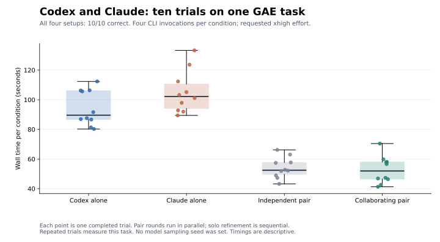

# Ten trials on an RL programming task

All four setups solved the GAE task in all ten trials. Collaboration preserved correctness, but this task showed no accuracy advantage over either model alone or an independent pair.

[Download PNG](findings/gae-10-trials.png) · [Download SVG](findings/gae-10-trials.svg) · [Per-trial data](findings/gae-10-trials.json)

| Setup              | Correct finals | Mean wall time ± SD | Mean reported tokens | Failed calls |
| ------------------ | -------------: | ------------------: | -------------------: | -----------: |
| Codex alone        |          10/10 |       94.5 ± 11.9 s |               48,383 |            0 |
| Claude alone       |          10/10 |      105.1 ± 14.3 s |               31,780 |            0 |
| Independent pair   |          10/10 |        54.1 ± 7.1 s |               38,502 |            0 |
| Collaborating pair |          10/10 |        52.7 ± 9.3 s |               38,361 |            0 |

The run used 160 confirmed CLI invocations, with 0 failed calls. Usage was available for 160 calls (1,570,249 reported tokens in total). Token counts follow each provider's reporting and do not establish equal compute or cost. Wall time includes final grading; means and sample standard deviations cover completed conditions.

## What was compared

Each trial used the same Generalized Advantage Estimation (GAE) specification: implement a JavaScript function handling termination, truncation, and rollout boundaries. The prompt supplied the recurrence and boundary semantics. Each final answer faced 27 checks withheld from the models; no grading feedback was used to revise or select an answer.

- **Codex alone / Claude alone:** four sequential invocations, starting with an independent answer and then three self-reviews.
- **Independent pair:** both models ran in parallel for two rounds, each reviewing only its own first answer.
- **Collaborating pair:** both models ran in parallel for two rounds; in the second round, each saw its own answer and its peer's answer and summary.

Pair conditions used a preselected final submitter: Codex for five trials and Claude for five. Condition order rotated by trial. Each condition had four invocations. The independent pair controls for the model mixture and parallel execution when comparing against collaboration.

Requested models were `gpt-6-astra` and `claude-fable-5-1[1m]`, both at `xhigh` effort. Clients were Codex 0.154.0 and Claude Code 2.1.277. These were fresh CLI invocations, without a model sampling seed. They are repeated trials, not ten seeded RL training runs. The earlier one-trial pilot is excluded.

## What this finding supports

The bounded exchange completed on this task and produced the outcomes above. Pair latency also reflects parallel execution, while solo refinement was sequential; faster completion than a solo condition cannot be attributed to discussion alone. Timings are descriptive measurements on one shared development machine, with ordinary development work running during part of the study.

This is one task with an explicit recurrence, so the results do not establish better research ability or general coding performance. Ten repetitions measure consistency on that task. The 27 checks are not 27 independent research problems. A useful next comparison needs harder, varied tasks where the baselines leave room for improvement.

The benchmark used a separate, bounded answer-exchange prompt with tools disabled. It did not exercise the full interactive terminal workflow or the current repository collaboration prompts. The prompt revisions in this repository were made after this evaluation began and have not been compared in a new model evaluation.

## Provenance

Run: 2026-09-18T20:43:08.795Z to 2026-09-18T21:34:13.883Z.

The frozen runner and task definitions came from [commit 58b9429](https://github.com/Arth-Singh/Model-Collab/tree/58b9429). Benchmark execution code and raw traces are maintained outside the current product tree. This page and its data contain the published finding.

Manifest SHA-256: `62b719794dfcc941d1561fa0007664ade9b7e436ebf52d29b5549ebf1fa53327`. The data file also records the raw report hash.
