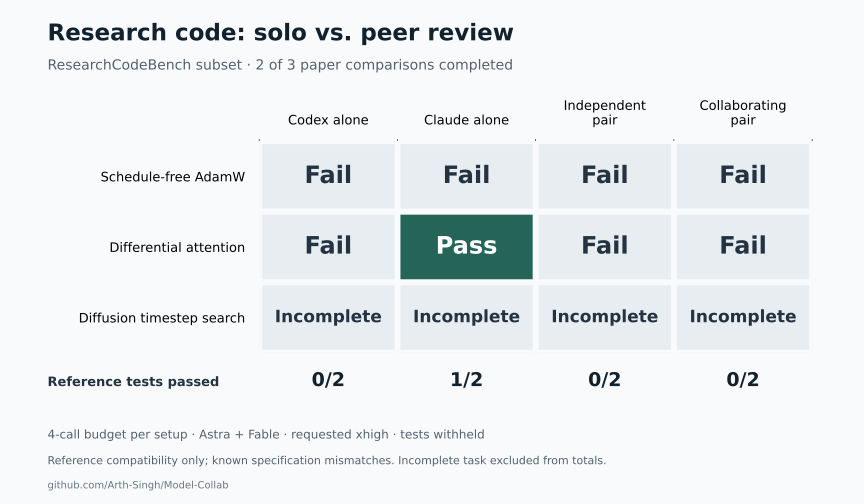

# Research-code pilot: results and benchmark audit

This pilot does not establish a quality advantage from collaboration. On the
2 tasks completed by every setup, reference-test matches were:
Codex alone 0/2, Claude alone 1/2, Independent pair 0/2, Collaborating pair 0/2. Diffusion timestep search did not complete all conditions and is
excluded from those totals. The planned repeated-trial study remains unfinished.

[PNG](findings/research-code-pilot.png) · [SVG](findings/research-code-pilot.svg) ·
[Per-submission data](findings/research-code-pilot.json)

| Task                      | Codex alone | Claude alone | Independent pair | Collaborating pair |
| ------------------------- | ----------- | ------------ | ---------------- | ------------------ |
| Schedule-free AdamW       | Fail        | Fail         | Fail             | Fail               |
| Differential attention    | Fail        | Pass         | Fail             | Fail               |
| Diffusion timestep search | Incomplete  | Incomplete   | Incomplete       | Incomplete         |

“Pass” means passing the unchanged upstream tests. “Fail” means a submitted final
failed those tests. Neither label establishes whether the research paper was
implemented correctly; the specification mismatch below materially limits that
interpretation. “Incomplete” is a runtime outcome, not a wrong answer.

## What was compared

We selected three CPU-compatible papers from
[ResearchCodeBench](https://researchcodebench.github.io/), using the largest
annotated block in each selected file: the optimizer step, differential-attention
forward pass, and diffusion timestep-search procedure. This was a convenience
sample selected before inference, not the full benchmark or a leaderboard score.
Each prompt supplied the full paper and surrounding code with one block removed.
Reference implementations, tests, and published scores were withheld.

Each condition had a four-call budget:

- **Solo:** an independent proposal followed by three self-reviews.
- **Independent pair:** a proposal and self-review per model, without seeing the
  peer's answer.
- **Collaborating pair:** two independent proposals, a peer review comparing
  them, and a final response to that review.

The pair's final author was fixed before inference: Codex for the optimizer and
diffusion task, Claude for attention. Both pair conditions used the same author.
No grader selected between answers. Tools were disabled; candidates received
Python syntax feedback only. Behavioral grading began after all final records
were locked. This tests a bounded peer-exchange protocol, not the full native
terminal workflow or an old-versus-new prompt ablation. Equal calls do not imply
equal tokens, compute, or cost.

Requested models were `gpt-6-astra` and `claude-fable-5-1[1m]`, both at `xhigh`.
Claude reported `claude-fable-5-1`; Codex did not report
a model ID in its result events. Applied effort was not independently verified.
No model sampling seed was set. Grading fixed Python, NumPy, and PyTorch seeds to
42; upstream tests may reset them. These were not seeded RL training experiments.

## A material specification mismatch

The supplied optimizer
[paper](https://github.com/PatrickHua/ResearchCodeBench/blob/db3d16d94cfa6b6785bef6f1db0263edfe6f1d34/pset/schedule_free/paper2code_paper.tex#L364)
fuses Adam bias correction into the learning rate. The benchmark
[reference](https://github.com/PatrickHua/ResearchCodeBench/blob/db3d16d94cfa6b6785bef6f1db0263edfe6f1d34/pset/schedule_free/adamw_schedulefree_reference.py#L207)
applies it in the denominator. This also changes weight decay and averaging.
With parameter and gradient 1, learning rate 0.1, beta2 0.999, weight decay 0.5,
epsilon 1e-8, and no warmup, the first update is approximately **0.89842 under the
paper and 0.85 under the reference**. A paper-faithful answer can fail this test.
Both collaborating models identified the ambiguity before grading.

In attention, the collaborating final and solo Codex both unpacked `rel_pos` as
a cosine/sine pair; the upstream fixture supplies a matrix and the reference
ignores it. Both finals raised an exception. The attention reference also adds
supplied masks numerically, including Boolean masks. The diffusion test uses a
stochastic mock, making exact equality sensitive
to model-call order. Original implementations passed preflight, and missing code
plus deliberately wrong mutations failed. Those controls demonstrate that the
selected blocks are exercised; they do not establish a complete or unambiguous
specification. We kept the official tests unchanged and report these limitations.

After this pilot, the research prompt was tightened to require caller-contract
checks before adopting a peer's change and explicit identification of paper/code
version conflicts. That revision has not been evaluated in a new model run.

## Run limits and records

An initial attempt planned three repetitions per task. It was stopped before any
final answer or behavioral grade after two calls exceeded a 180-second cap.
Eleven calls had launched, with four still running when it was stopped. Those
records are retained separately and excluded from this comparison.

The restarted attempt used one repetition per task, a 360-second call cap, a
25-minute overall cap, and up to 48 fresh calls. It launched **42
calls**, with **6 unfinished calls** due to limits. Reported usage
was available for 36 calls: 1,969,354 tokens.
Usage excludes the first attempt and may omit work done by interrupted calls.
The incomplete diffusion comparison is retained in the data and excluded from
the matched comparison. These resource limits do not demonstrate a reasoning
failure by either model.

The sample is too small and the contracts too ambiguous for a credible uplift
estimate. Public papers and code also mean training exposure cannot be ruled out.
Before a larger study, candidate tasks need audited paper-to-code contracts and
enough runtime for every condition to finish.

Upstream commit:
[`db3d16d`](https://github.com/PatrickHua/ResearchCodeBench/tree/db3d16d94cfa6b6785bef6f1db0263edfe6f1d34).
Manifest SHA-256: `f2d43476637c69268ab0368f22e514129ddff5eb7206eba07b4989e86a72227e`.
Final records locked at `2026-09-19T15:01:49.383Z`; grading completed at
`2026-09-19T15:01:55.178Z`. The linked data includes input and raw-result hashes.
Execution code and raw traces remain outside the public product.
